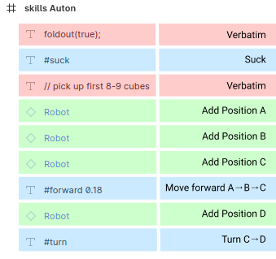

## Generate Motion Profile from SVG

As a convenience for generating a path for autonomous, you can edit an SVG (through Figma) to specify points. Any circle with opacity 0.98 specifies one point on the path, with points later in the SVG file (higher in Figma) specifying points earlier in time.

In order to use Figma to edit this profile, it is convenient to create a component representing the robot with a circle in the center. Then to specify a new point on the path, duplicate the component and move/rotate as necessary.

To actually move, you need to specify macros through text boxes in Figma. Create a text box anywhere in-frame, and reduce opacity to 0.01% or something so it is invisible to humans but not the SVG. Name the text box "#forward \<speed\>" such as "#forward 0.21" based on the following command table:

| Macro | Description |
|------------|----------|
| `#forward <speed>` | Move forward |
| `#back <speed>` | Move backward |
| `#turn` | Turn in place |
| `#suck` | Suck intake at full speed |

The movements work on a stack system: Each robot in the sidebar adds a position/angle to the path, then a move macro moves between these positions. They always assume movement starting at the first position in the stack and ending at the last position, so the last position in one stack is automatically the first position in the next stack.

Other fragments of code can be included as text boxes and are copied verbatim to the output code. Supported lines are those ending in a semicolon `;` or starting with `//` for a comment. Thus a text box named `intake.stop();` would be copied, as would `// finish stacking` or `lift.move(1); // small tower`, but other formats of text are ignored.

Example:

To export, select the frame, then <kbd>Export as SVG</kbd> in the bottom right. Make sure to check the "Include 'id' Attribute" option, and you may like to uncheck "Outline Text" to avoid vectoring the text inside text elements.

Once the SVG is downloaded, run

    python3 auto-profile.py <path to SVG> [-s <scale>]

e.g.

    python3 auto-profile.py "Idea 1.svg" -s 2
